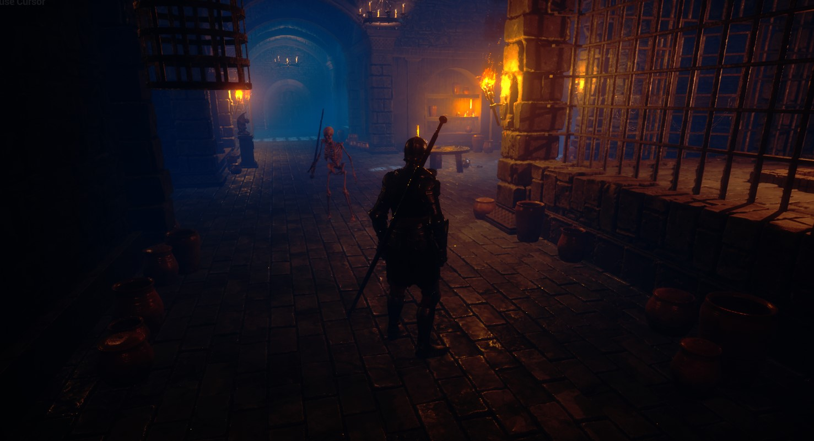
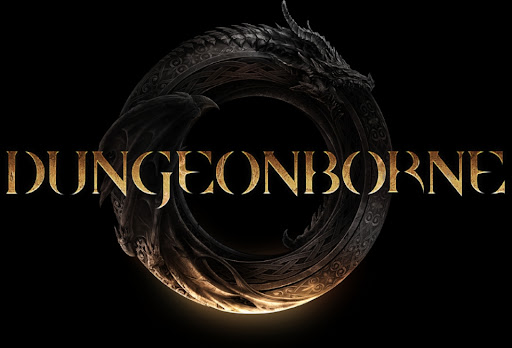
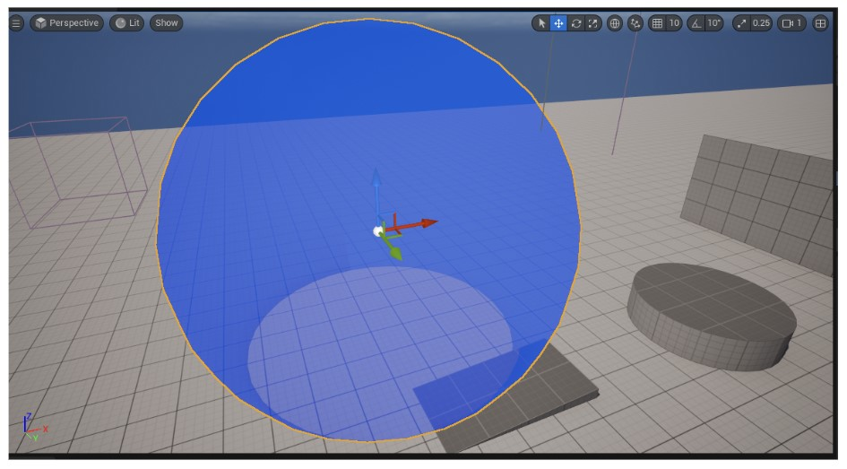
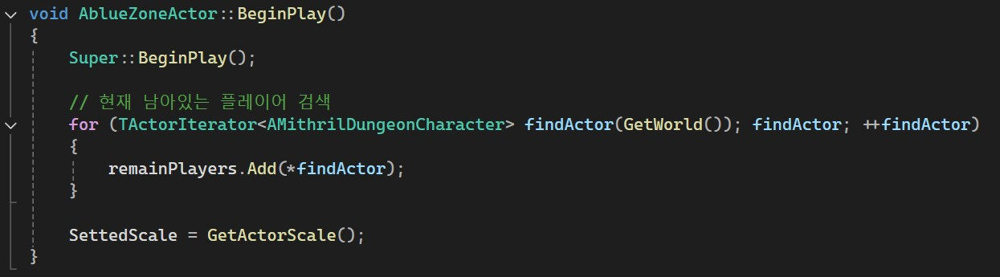
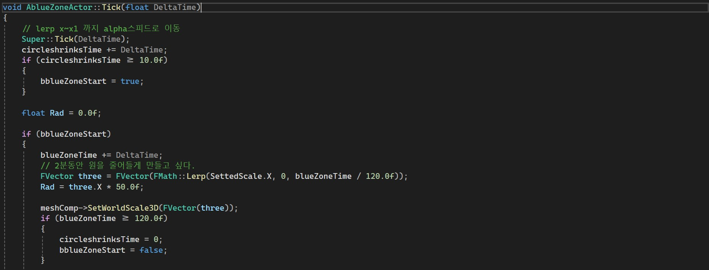
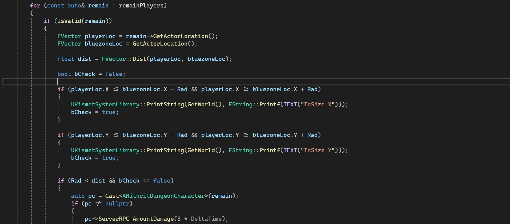
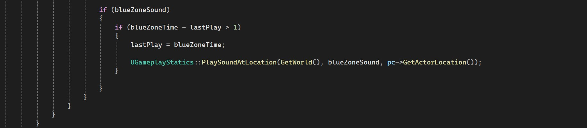
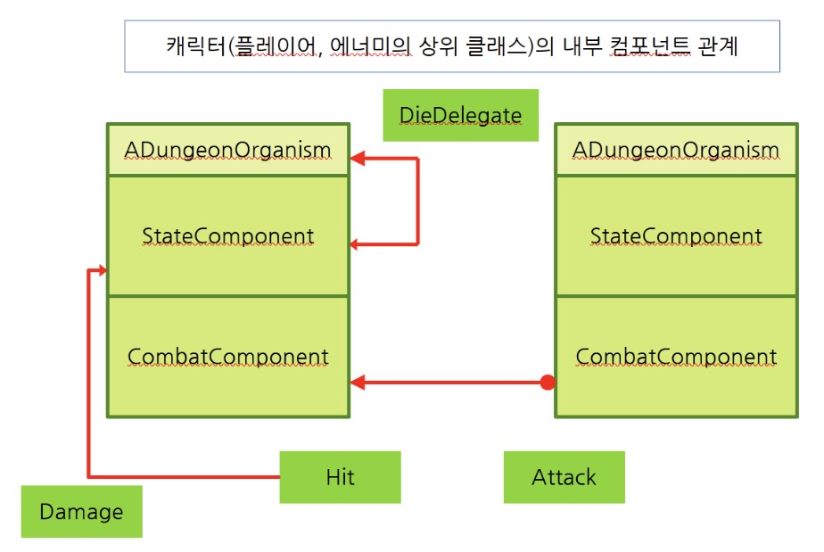
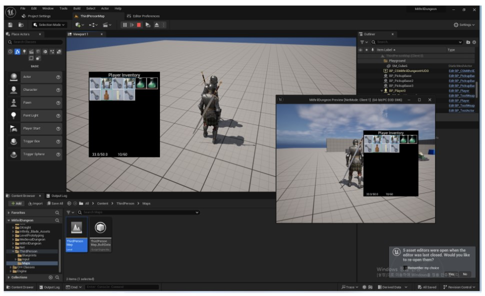
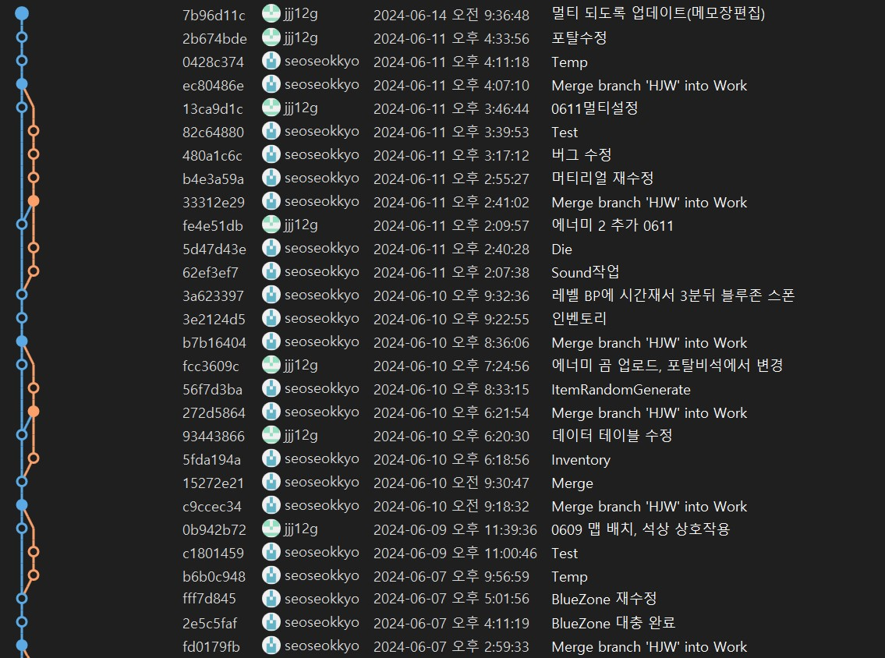

# MithrilDungeon

   
  
   

목차

1. 프로젝트 개요
2. 진행한 작업
3. 느낀점

## 1. 프로젝트 소개

<table>
  <tr>
    <td style="width: 30%; vertical-align: top;">
      
    </td>
    <td style="width: 70%; vertical-align: top; text-align: left;">
      <h3>프로젝트 개요/동기</h3>
      <ul>
        <li>3주간 2인으로 진행한 프로젝트</li>
		<li>처음으로 네트워크 기능이 들어간 프로젝트</li>
		<li>2차 프로젝트에서의 블루프린트 기반으로 만들어진 기능을 C++로 번역 및 리팩토링해서 적용</li>
      </ul>
    </td>
  </tr>
</table>

## 기술 스택

|	GitHub	|UnrealEngine|	Blender		|	C++	|
| :------: 	| 	:------: |	:------: 	|:-----:|
| ![github]	| 	![ue]	 |		![bd]	|![c++]	|

 

## 2. 진행한 작업

- 전체적인 시스템

- 기존에 사용하던 기능들 네트워크가 되도록 변경

- 플레이어 캐릭터의 전체적인 기능

- 네트워크 기능 작업

- 다른 팀원이 작업한 인벤토리 관련 디버깅 및 네트워크 기능 추가

- 다른 팀원이 작업한 인벤토리 기능에 상대 플레이어 인벤토리를 루팅할 수 있게 기능 추가

- 이런 장르 게임에서 주로 사용되는 시간제한 기능 작업

- 깃 관리

### 2-1. BlueZone 기능[시간제한]
<table>
  <tr>
    <td style="width: 30%; vertical-align: top;">
      
	  
	  
	  
	  
    </td>
  </tr>
  <tr>
    <td style="width: 70%; vertical-align: top; text-align: left;">
      <ul>
        <li>게임시작 후 3분뒤에 스폰되는 블루존 기능 구현</li>
		<li>스폰된 시점에 맵에 남아있는 플레이어만 검색해서 보관</li>
		<li>블루존의 범위 외에 있는 캐릭터에게 Tick데미지를 주며 2분간 범위가 점점 좁아지게 됨</li>
		<li>처음 기능 작성 시 엔진이 제공하는 Sweep기능으로 작업을 하였으나 실제 레벨에서 테스트 할 때 성능 이슈가 너무 심해서 직접 계산으로 변경</li>
		<li>세팅해놓은 Scale값을 BeginPlay시점에 취득 후 기능 동작 시점부터 Tick단위로 스케일 감소 Lerp적용</li>
		<li>남아있는 플레이어 중 BlueZone의 중심에서부터 X, Y로 플레이어 위치를 체크하여 벗어나 있는 경우 데미지 적용</li>
      </ul>
    </td>
  </tr>
</table>

### 2-2. 캐릭터 상위 클래스 작성
<table>
  <tr>
    <td style="width: 30%; vertical-align: top;">
      
    </td>
    <td style="width: 70%; vertical-align: top; text-align: left;">
      <ul>
        <li>2차 프로젝트에서 번역 및 리팩토링을 진행해놓았던 캐릭터 기능들 사용</li>
		<li>해당 프로젝트에 맞게 기능 변경 진행</li>
		<li>기존에 캐릭터의 상위클래스 부재로 인해 작업을 여러번 해야하던 상황 개선</li>
		<li>네트워크 기능 추가</li>
      </ul>
    </td>
  </tr>
</table>

### 2-3. 인벤토리 기능 추가
<table>
  <tr>
    <td style="width: 30%; vertical-align: top;">
      
    </td>
    <td style="width: 70%; vertical-align: top; text-align: left;">
      <ul>
		<li>네트워크 기능이 없는 상태여서 네트워크 작업</li>
        <li>다른 캐릭터의 인벤토리를 루팅하는 기능을 목적으로 작업 시작</li>
		<li>결과적으로는 상대 인벤토리를 보는 기능까지는 완성이 되었으나 아이템을 가져오는 기능은 완성을 못함</li>
      </ul>
    </td>
  </tr>
</table>

### 2-5. 깃 관리
<table>
  <tr>
    <td style="width: 30%; vertical-align: top;">
      
    </td>
  </tr>
  <tr>
    <td style="width: 70%; vertical-align: top; text-align: left;">
      <ul>
        <li>선호하는 깃 관리방식인 Release/Work(최신)/Worker1/Worker2....방식으로 깃 관리를 진행</li>
      </ul>
    </td>
  </tr>
</table>

 

## 3. 느낀점

- 언리얼에서 제공하는 기능을 가져다 쓰면 결과물 보기도 편하고 좋기는 하지만 Sweep같은 리소스 소모량이 큰 기능을 생각없이 쓰면 크리티컬한 이슈가 생긴다는 것을 알게 됨

- 언리얼의 네트워크 철학이 생소하여 잘 감이 잡히지 않았으나 마무리 단계에서는 조금 와닿은 것 같음

- P2P기는 하지만 게임에 서버를 물리는 과정이 생각보다 어렵지는 않아 신기했던 프로젝트

 

## 라이센스

MIT &copy; [NoHack](mailto:lbjp114@gmail.com)

<!-- Stack Icon Refernces -->

[git]: /images/stack/Git.svg
[github]: /images/stack/GithubDesktop.svg
[ue]: /images/stack/UnrealEngine.svg
[bd]: /images/stack/Blender.svg
[c++]: /images/stack/C++.svg
[mfc]: /images/stack/Microsoft_Foundation_Class.svg